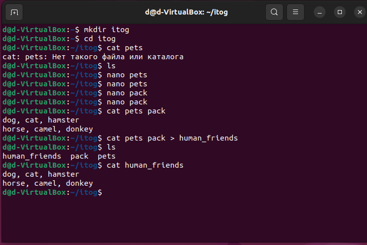
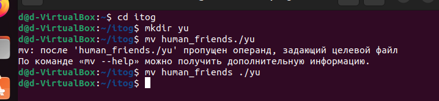
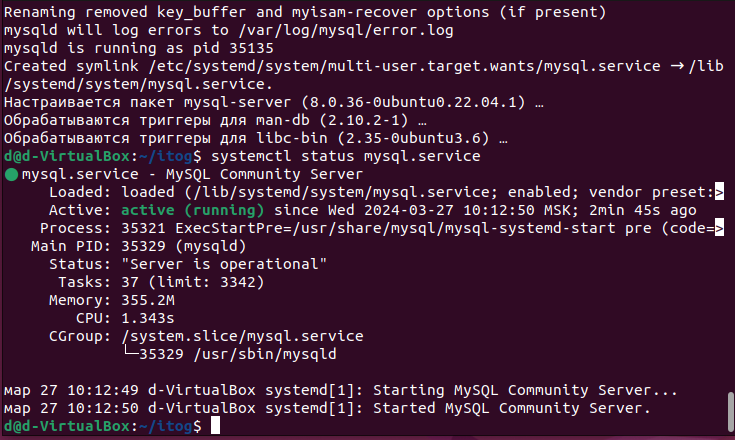
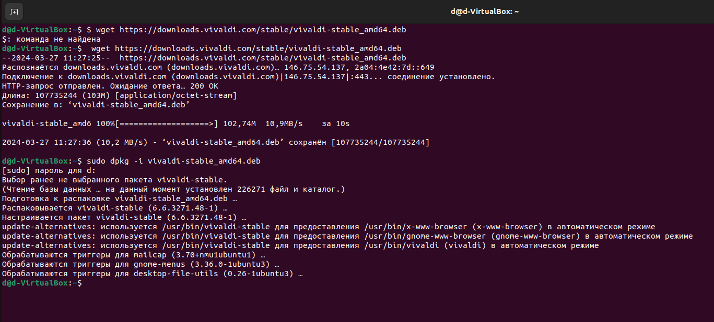
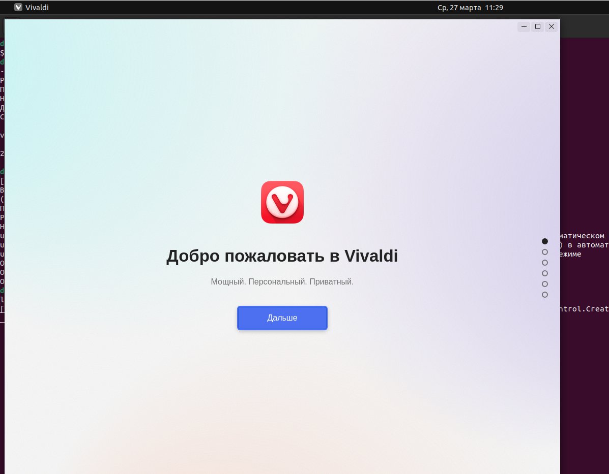
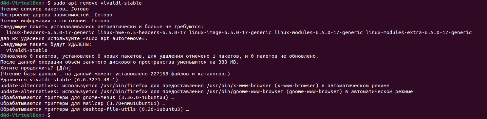
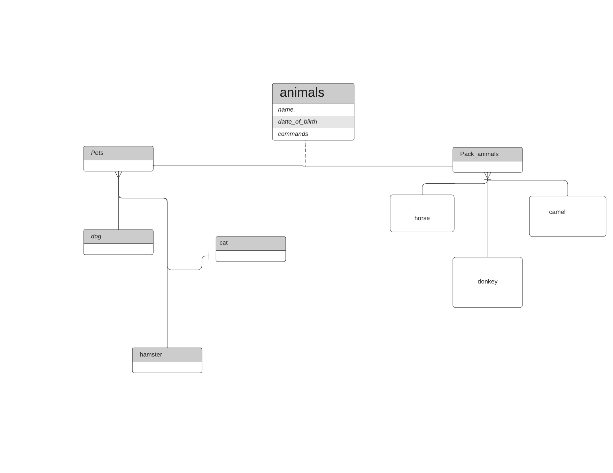

# Итоговая контрольная работа

## Операционные системы и виртуализация (Linux)

1. Использование команды cat в Linux

2. Работа с директориями в Linux

3. Работа с MySQL в Linux. 

4. Управление deb-пакетами

## Объектно-ориентированное программирование 
1. Диаграмма классов

 2. ООП и Java

[ооп](https://github.com/Dariagb/itogblok/tree/main/itog/registry_oop)

## Работа с MySQL 

[sql](itogsql.sql)

## Программа-реестр домашних животных

[java](https://github.com/Dariagb/itogblok/tree/main/itog/itogregister2)

